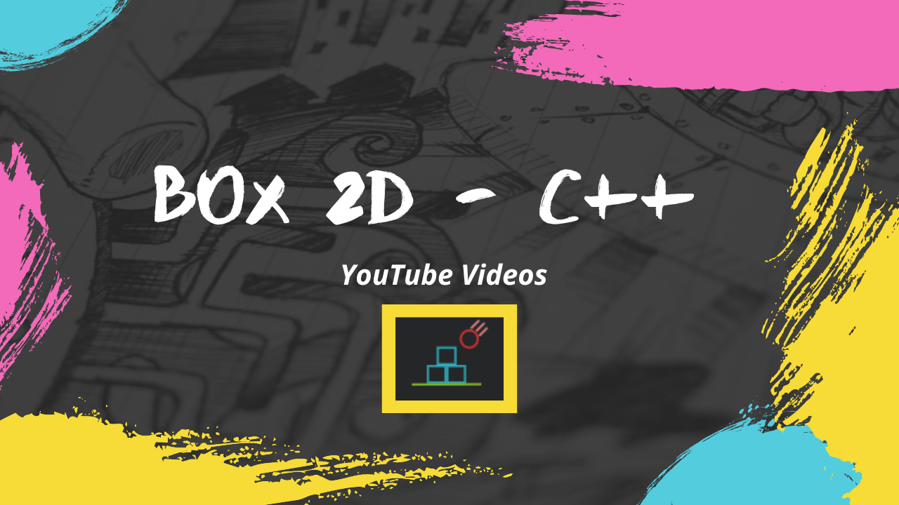

# Box2D YouTube Playlist



Welcome to the Box2D YouTube Playlist repository! This repository accompanies a YouTube playlist dedicated to learning and working with the Box2D physics engine.

## Playlist Overview

This repository is a companion to the [Box2D YouTube Playlist](https://youtube.com/playlist?list=PLVRDPs83Zhmeh9tbM87q3WqguttGFEjB5&si=DvV69DgMj-1KU1Mu). The playlist covers various topics related to Box2D, including installation, setup, and creating simple physics simulations. 

### Watch the Playlist

Start watching the playlist [here](https://youtube.com/playlist?list=PLVRDPs83Zhmeh9tbM87q3WqguttGFEjB5&si=DvV69DgMj-1KU1Mu).

## First Video: Installation Guide

In the first video of the series, I walk through the process of installing Box2D. You can watch the first video [here](https://youtu.be/ZNkL7IBRZ5o?si=Js_3hz2m1Zekr8Oj).

### Installation Steps

1. **Access the Box2D Home Page**  
   Visit the [Box2D homepage](https://box2d.org/) and click on the Git icon to access the source code repository.

2. **Install Git**  
   If you do not already have Git installed, you can download and install it from the [official Git website](https://git-scm.com/).

3. **Install vcpkg**  
   Install vcpkg, a package manager for C++ libraries, by following the instructions on the [vcpkg GitHub page](https://github.com/microsoft/vcpkg).

4. **Install Box2D via vcpkg**  
   After setting up vcpkg, use it to install Box2D by running the following command:
   ```bash
   vcpkg install box2d
